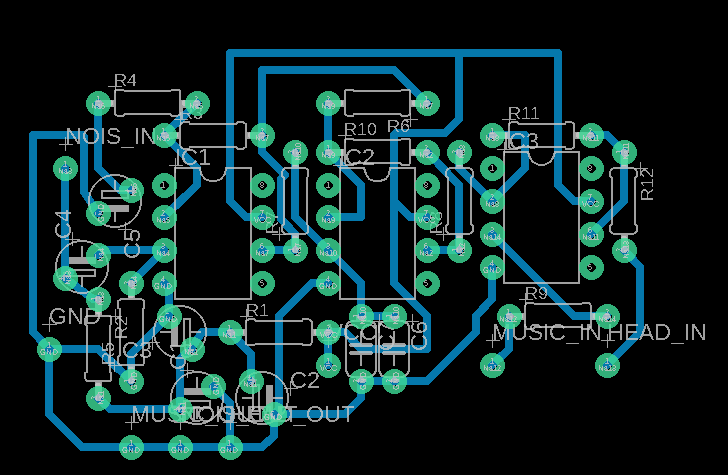
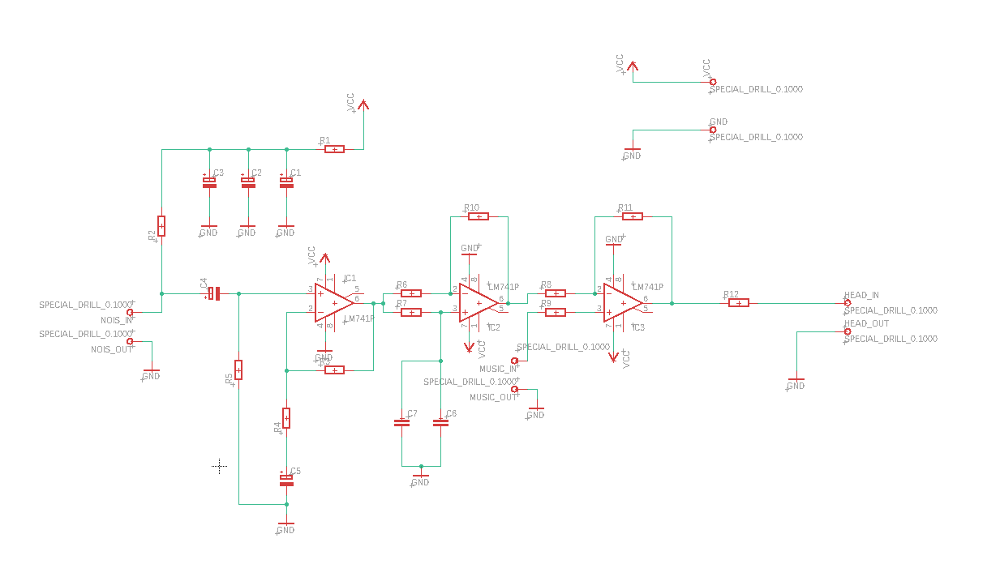

# Analog Active Noise Cancellation System

## Overview
This project implements an analog active noise cancellation (ANC) system using op-amp based signal processing techniques. The goal is to reduce ambient noise through phase inversion and destructive interference.

## Key Features
- Fully analog design (no DSP)
- Phase inversion using all-pass filter
- Signal conditioning using op-amps
- Custom PCB design

## System Architecture

1. Noise input is captured via microphone
2. Signal is processed through:
   - Amplification stage
   - Phase inversion (all-pass filter)
3. Output signal is combined to cancel noise

## Circuit Design

- Op-Amps: LM741
- Key Blocks:
  - Amplifier
  - All-pass filter (phase shift)
  - Output driver

## PCB Layout

---

## Schematic

---

## Theory

Active Noise Cancellation works by generating a signal that is:
- Equal in amplitude
- Opposite in phase (180°)

When combined:
Noise + Anti-noise → Cancellation

## Challenges Faced

- Achieving precise phase shift
- Noise amplification instability
- Analog component tolerance issues

## Future Improvements

- Replace LM741 with low-noise op-amps
- Move to hybrid analog + DSP system
- Real-time adaptive filtering

## Author

Mihit Saxena
